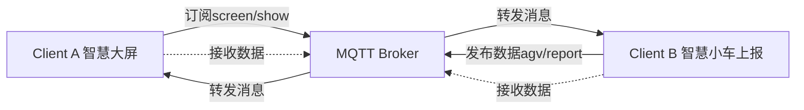

构造这样一个场景

# 场景说明

服务实现的是一个server端为broker

1. clientA 是一个智能小车，上行发布消息，topic是**agv/report**
2. clientB 是一个智能大屏，汇总各种智能设备的消息，订阅的消息topic是screen/show
3. server是netty架构的服务端
4. 工具类提供了服务的rsa的单向加密操作

server的实现分为

- sender发送端
- receiver接受端

# 测试构造

测试的场景用例

## Case1：转发订阅

clientA 通过agv/report上报信息给broker，broker完成转发到screen/show的topic，智慧大屏订阅了screen/show，然后展示这个消息。



详见：[转发订阅流程说明图.puml](%E8%BD%AC%E5%8F%91%E8%AE%A2%E9%98%85%E6%B5%81%E7%A8%8B%E8%AF%B4%E6%98%8E%E5%9B%BE.puml)


## Case2：客户端下发

broker和clientA智慧小车完成

用户调用 http://localhost:8080/sender/mqtt/send 接口下发指令给具体的topic，客户端进行相应
详见：[转发订阅流程说明图.puml](%E8%BD%AC%E5%8F%91%E8%AE%A2%E9%98%85%E6%B5%81%E7%A8%8B%E8%AF%B4%E6%98%8E%E5%9B%BE.puml)


# 客户端构造

MQTTX的数据集导入

- mqttx的客户端导入json配置[mqttX-client.json](说明/mqttX-client.json)
- 服务端的下发语句
  ``````shell
  curl --location 'http://localhost:8080/sender/mqtt/send' \
  --header 'Content-Type: application/json' \
  --data '{
      "header": {
          "messageId": "1234567890",
          "version": "1.0",
          "topic": "agv/cmd",
          "clientId": "mqttx_26bac6e6",
          "messageType": "REPORT",
          "requestType": "request",
          "timestamp": 1634567890123,
          "traceId": "trace123456",
          "interfaceName": "getTemperatureData",
          "code": 200
      },
      
      "body": {
          "temperature": 25.5,
          "humidity": 60,
          "power": 85,
          "status": 1,
          "x": 10,
          "y": 20
      }
  }'


