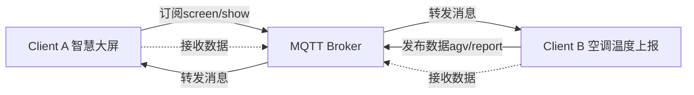

构造这样一个场景

服务实现的是一个server端为broker

1. clientA 是一个智能小车，上行发布消息，topic是**agv/report**
2. clientB 是一个智能大屏，汇总各种智能设备的消息，订阅的消息topic是screen/show
3. server是netty架构的服务端
4. 工具类提供了服务的rsa的单向加密操作

server的实现分为

- sender发送端
- receiver接受端

测试的场景用例

Case1：clientA 通过agv/report上报信息给broker，broker完成转发到screen/show的topic，智慧大屏订阅了screen/show，然后展示这个消息。

Case2：clientA和用户端完成